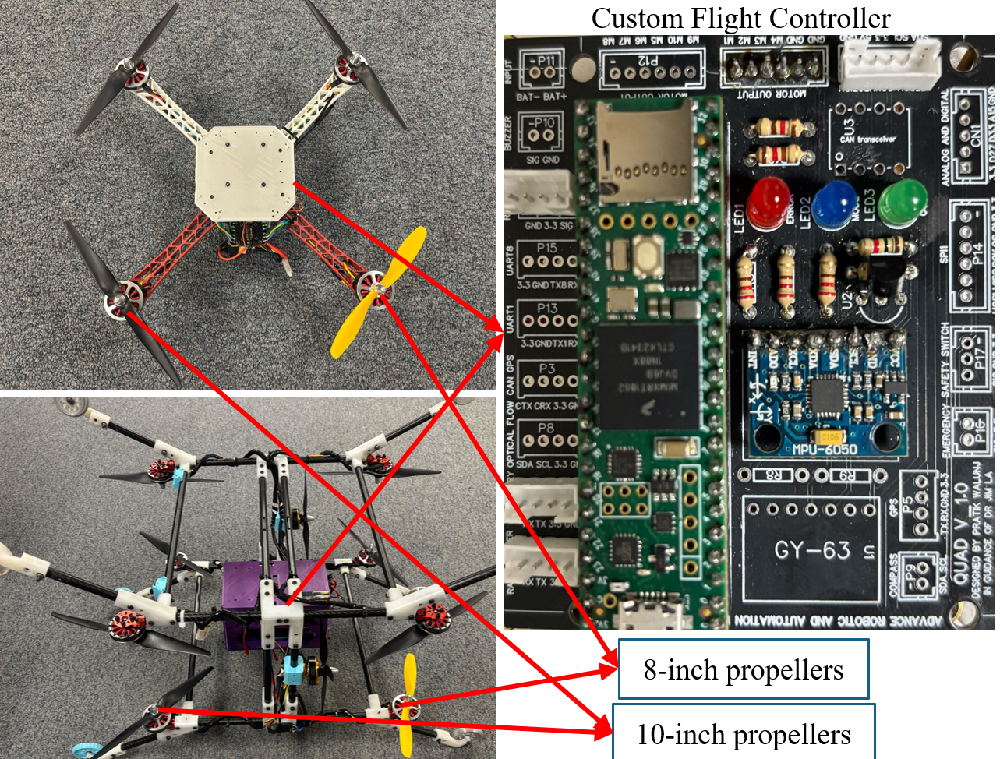
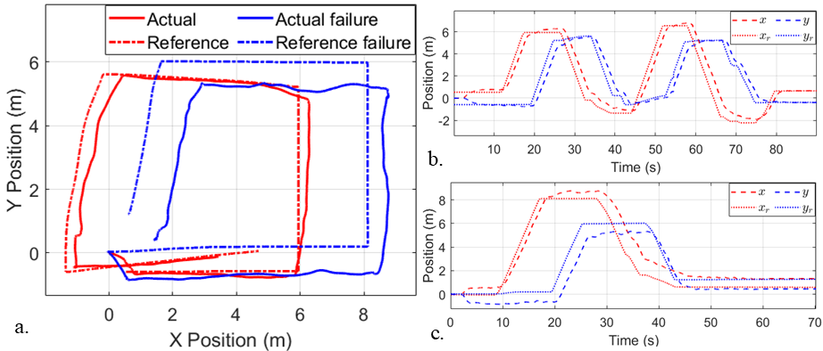
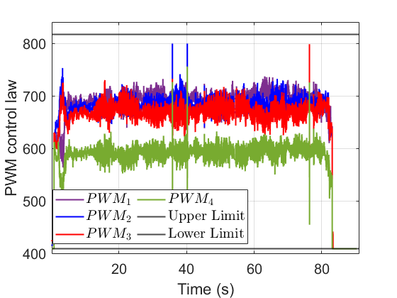
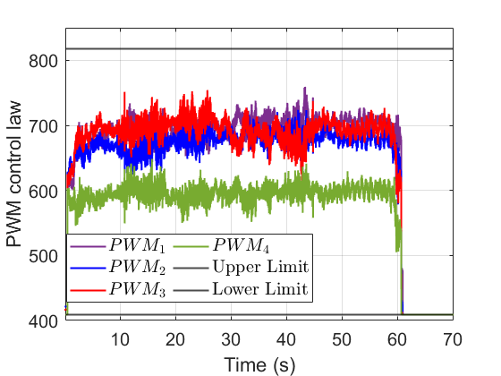

# Cube-Drone: A Multi-sensor Hybrid Drone for Multi-Terrain Mobility, 3D Mapping, and Steel Structure Inspection
# Simulation

## Software Requirements & Setup

The simulation is configured with the following setup:
- Ubuntu 22.04
- ROS2 Humble
- Gazebo 11
- Xarco-ROS-Humble (sudo apt install ros-humble-xacro)
- Gazebo_ros_pkgs (sudo apt install ros-humble-gazebo-ros-pkgs)
- ACADO Toolkit (https://acado.github.io/)


Follow these commands in order to install the simulation of for the Cube-Drone:

```shell
# Step 1: Create and build a colcon workspace:
$ mkdir -p ~/ros2_ws/src
$ cd ~/ros2_ws/
$ colcon build
$ echo "source ~/ros2_ws/devel/setup.bash" >> ~/.bashrc

# Step 2: Clone this repo into your workspace
$ cd ~/ros2_ws/src
Download the folder smcmpcquad or the smcnmpccube in the main branch

# Step 3: Build the colcon workspace for this package
$ cd ~/ros2_ws
$ colcon build
```
* Note that the package contains the code generation and includes the qpOASES library. If the user wants to use SM-NMPC for a different problem, they need to regenerate the code and replace it to the include folder.
* Note that this project uses a custom plugin. Users need to replace the plugin path in the file /urdf/cube.urdf.xacro at line 1009. Replace: plugin name="cubeplugin" filename="/home/yourcomputername/dev_ws/install/smcnmpccube/lib/smcnmpccube/libcubeplugin.so" with the correct path by changing the username to the name of your computer. Then rebuild the project again to run the simulation.

## Simulation results


To run the simulation for Cube-Drone, follow these commands:

```shell
# Step 1: Run the Gazebo model:
$ ros2 launch smcnmpccube model.launch.py

# Step 2: Run the controller
$ ros2 run smcnmpccube smcnmpccube
```
## Motor failure results

To run the motor failure scenario, the user needs to modify the plugin in the /src/cubeplugin.cc. Change the added throttle to 50% as described in the manuscript. For the Cube, comment out line 177 and uncomment line 179.

Then rebuild the project and run the simulation as in the normal cases described above.

# Experiments
## Hardware Setups
We used the following sensors to control the Cube-Drone:
- Teensy 4.1 
- MPU 6050
- Micoair MTF-02P optical flow and LiDAR sensor (MTF-02P), TF Mini 1.8.1 for inspection
- FrSky X8R radio receiver

We used the following hardware to collect the data for 3D mapping and steel inspection:
- NVIDIA Jetson Orin
- Velodyne VLP-16 Puck LiDAR Sensor
- ZED Mini Stereo Camera for image capture
- DC HOUSE Mini Electric Linear Actuator Stroke
- Ultrasonic Thickness Gauge
  
## Embedded library
To embed the controller onto the Teensy 4.1, the user must download the ArduinoSMNMPC folder. This folder contains the library for NMPC (Nonlinear Model Predictive Control) and the implemented code for the flying robot. The user must copy the code generation library into the libraries folder of the Arduino IDE and then upload the sketch nmpcpidteensy.ino to the Teensy 4.1. As discussed earlier, if the user wants to run their own NMPC controller for another system, they must generate the code according to the specific problem and then replace all the generated files in the library to update the embedded code. (Note that qpOASES is already included in the library.)

* Note: The embedded code may have some missing includes in the acado_qpoases_interface.cpp file. To fix this, change #include "INCLUDE/EXTRAS/SolutionAnalysis.hpp" to #include "SolutionAnalysis.hpp" and change #include "INCLUDE/QProblemB.hpp" to #include "QProblemB.hpp".
  
## Results

We also test the stability of the proposed on the motor failure cases:
<p align="center">
  
</p>
<p align="center">
  
</p>
<p align="center">
  
  
</p>
